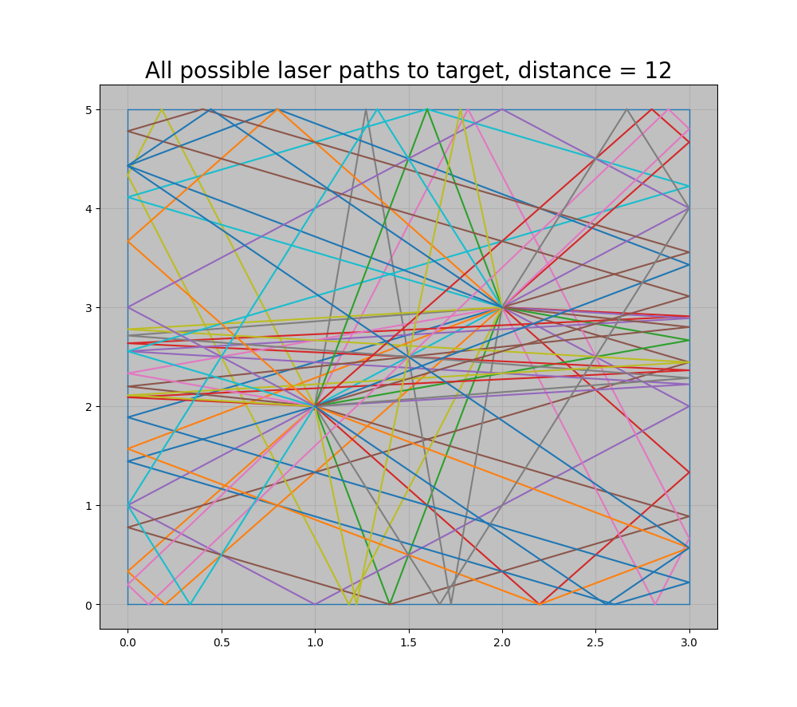
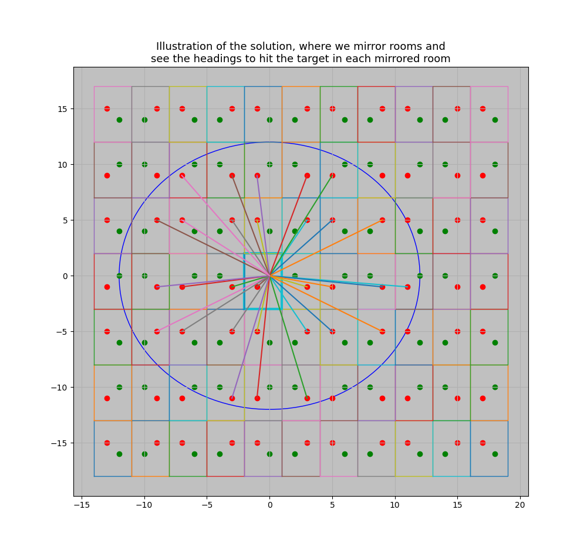
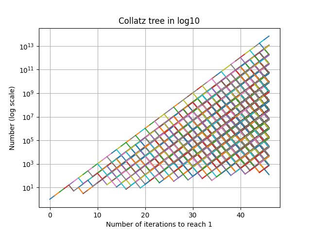

# Some standalone algorithms

This repository contains some standalone algorithms that are implemented in Python.
Namely, this contains The Google Foobar challenges (and visualization of 4.2 lasers), a collatz conjecture visualizer, tic-tac-toe, and two advent-of-code challenges.

## Visualization of 4.2 lasers



*Figure 1: This image shows the problem in Foobar42. The problem is to count the number of distinct headings you can shoot a laser to in a room with reflective walls, so that the laser hits the target before having travelled a certain distance, and not hitting myself.*



*Figure 2: This image illustrates the solution to Foobar42. The solution consists of mirroring the original room many times all the way to the given distance, and then seeing which mirrored targets can be hit with a direct shot. Those headings will also hit the target after some number of reflections, and with the same travelled distance.*

## Collatz conjecture visualizer
Collatz conjecture is a famous conjecture in mathematics. It states that for any positive integer, if you repeatedly apply the following function, you will eventually reach n=1:
```
n = n/2 if n is even else 3n+1
```

The Collatz script creates a tree (starting from 1) and creates a tree of every value reachable from 1, when reversing the function, so that for example, at depth 6, are all numbers that take 6 steps to reach from 1.



*Figure 3: This image shows a graph produced by the Collatz visualizer. This shows the number on the y axis (log10) and the number of iterations to reach 1 on the x-axis. The top most line corresponds to the powers of 2, which reach 1 quickest.*